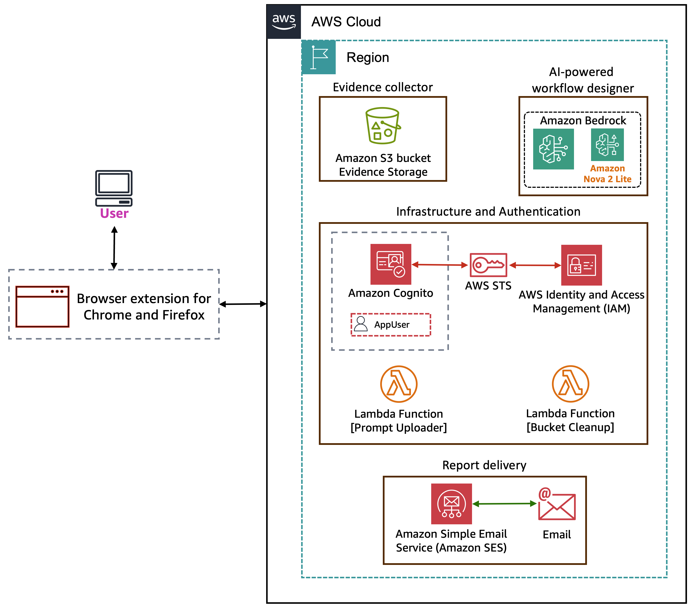
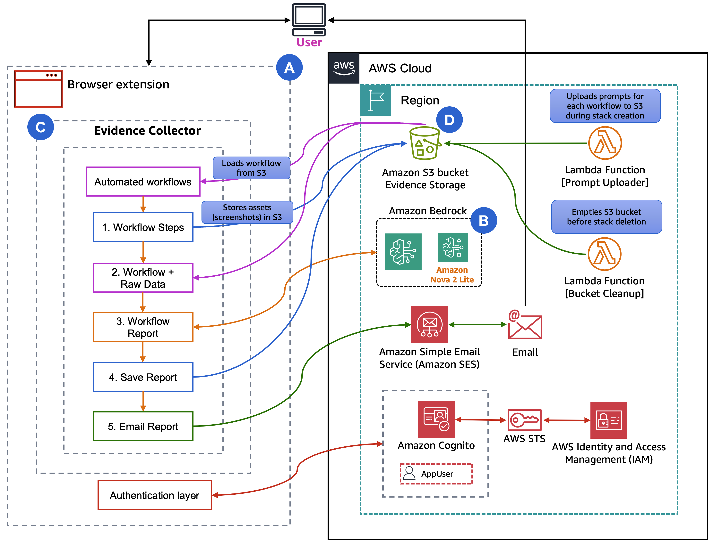
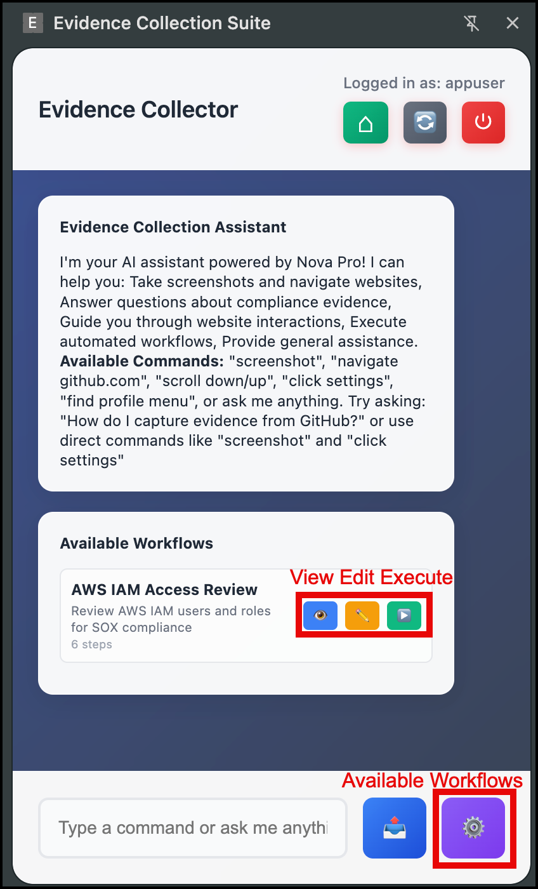
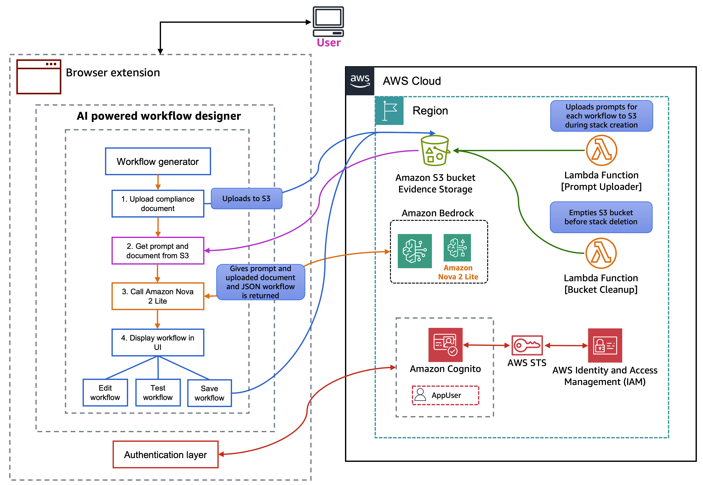
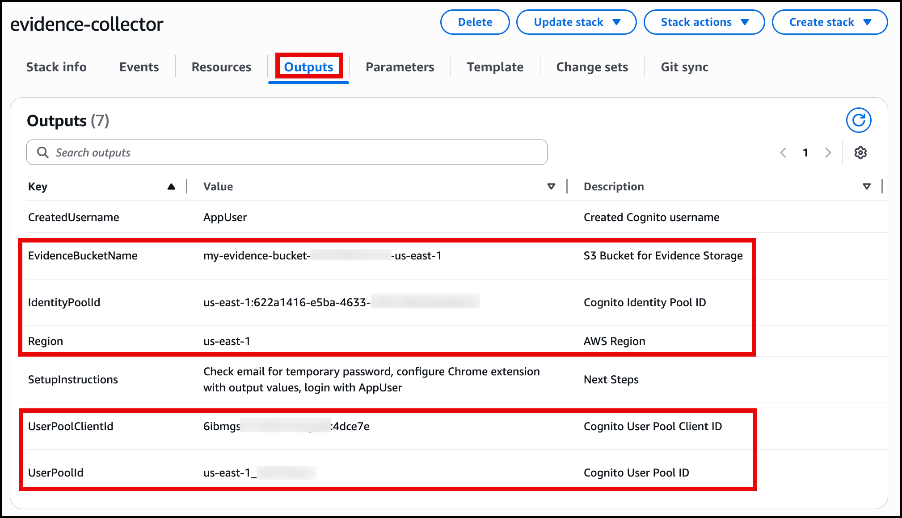
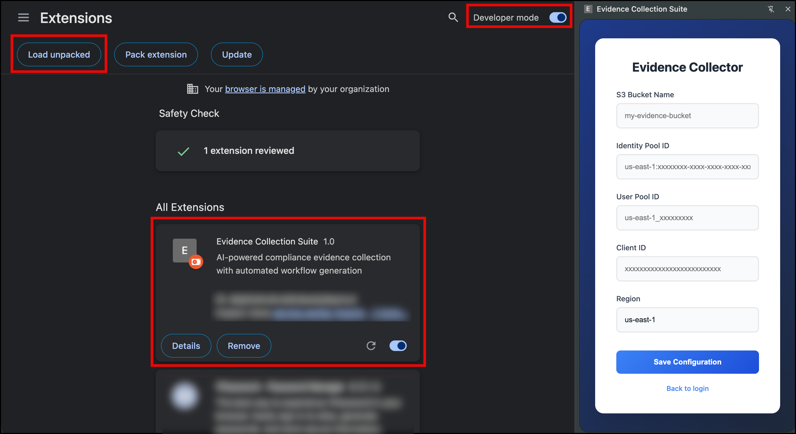
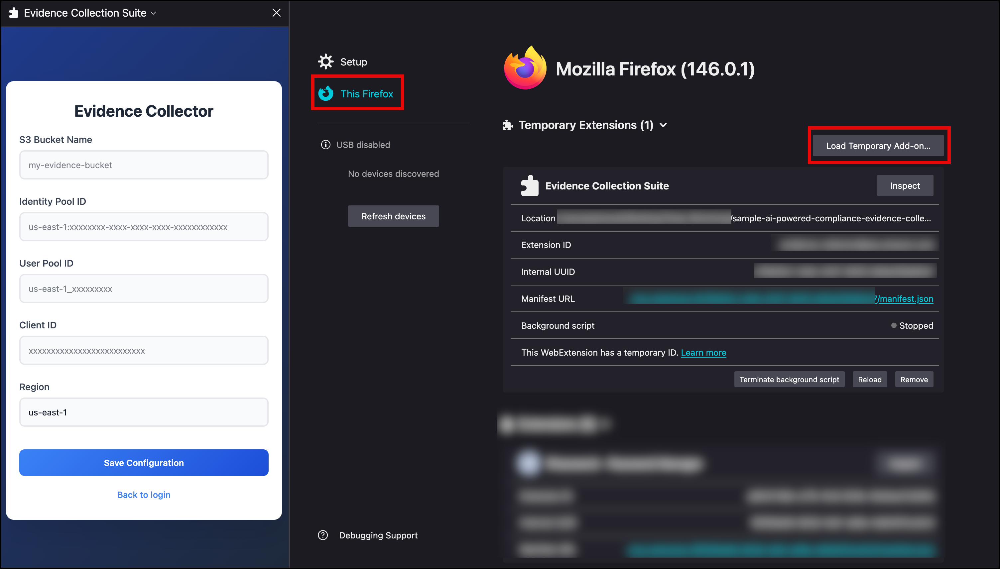
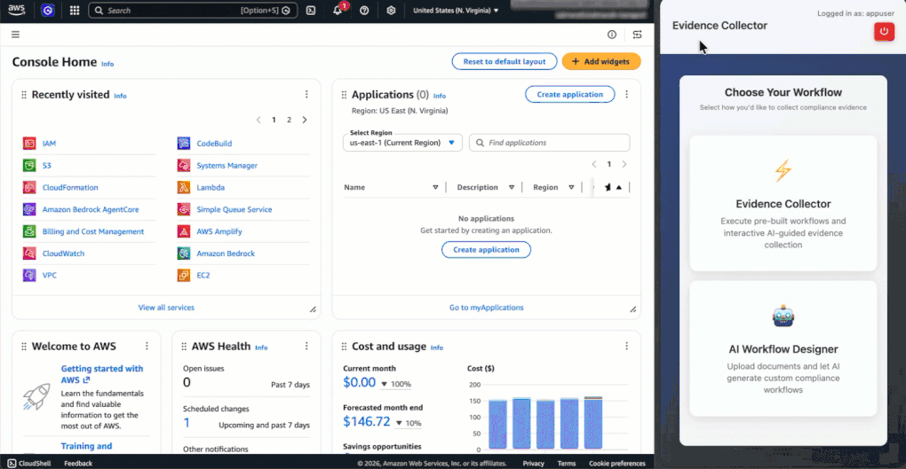

> [!NOTE]
> The content presented here serves as an example intended solely for educational objectives and should not be implemented in a live production environment without proper modifications and rigorous testing.
> 
# Building an AI-Powered Compliance Evidence Collector

Compliance audits require comprehensive evidence trails, often involving hundreds of screenshots across multiple systems. Your compliance teams likely spend hours manually navigating through [GitHub](https://github.com/) repositories, AWS consoles, and internal applications, capturing screenshots at each step. This manual process is time-consuming, error-prone, and difficult to reproduce consistently across audit cycles. This post demonstrates how we automated audit workflows using [Amazon Bedrock](https://aws.amazon.com/bedrock/) and browser automation.

In this post, we show you how to build a similar system for your organization. You will learn the architecture decisions, implementation details, and deployment process that can help you automate your own compliance workflows. We built a browser extension that automates this evidence collection process using Amazon Bedrock with the [Amazon Nova 2 Lite](https://aws.amazon.com/nova/) model. Your extension will execute pre-defined compliance workflows, automatically capture timestamped screenshots, and store organized evidence in [Amazon Simple Storage Service (Amazon S3)](https://aws.amazon.com/s3/). It can also analyze compliance documents and generate new workflows using natural language processing (NLP).

You will learn how we architected this solution, integrated Amazon Nova 2 Lite for intelligent automation, and implemented browser automation tools that handle the complexity of modern web applications. We cover the technical implementation details, deployment process, and real-world usage patterns.

## Solution overview

We chose browser automation combined with AI for several key reasons: it works with any web application without requiring API access, it captures visual evidence that auditors need, and it can adapt to UI changes through intelligent automation.

The solution uses a browser extension for Chrome and Firefox as the primary interface, providing three main capabilities: an evidence collector, an AI-powered workflow designer, and S3-backed report generation. The evidence collector executes pre-defined workflows, navigating through web applications and capturing timestamped screenshots in an Amazon S3 bucket. The AI-powered workflow designer communicates with Amazon Bedrock using the Amazon Nova 2 Lite model. When you upload a compliance text document, Amazon Nova 2 Lite analyzes it and generates executable workflow JSON that the extension can run. For report delivery, after a workflow completes, the extension saves an HTML compliance report to Amazon S3 and provides a download button in the side panel.

On the infrastructure side, two [AWS Lambda](https://aws.amazon.com/lambda/) functions support the solution: one uploads initial system prompts to the S3 bucket during deployment, and another handles bucket cleanup. For authentication and authorization, the extension uses [Amazon Cognito](https://aws.amazon.com/iam/) to manage user sign-in. Cognito works with [AWS Security Token Service (AWS STS)](https://docs.aws.amazon.com/STS/latest/APIReference/welcome.html) and [AWS Identity and Access Management (IAM)](https://aws.amazon.com/iam/) to provide the extension with scoped, least-privilege credentials for accessing Amazon Bedrock and Amazon S3. AWS encrypts evidence at rest, organizes it by date and workflow, and includes comprehensive audit logs.

<!-- TODO: Replace with actual image -->


## Architecture

Now that you understand what the system does, let's examine how it's structured. The browser extension will follow a modular architecture with four distinct layers:

<!-- TODO: Replace with actual image -->


### A. UI Layer

The side panel provides the primary interface with three components. The chat interface allows for natural language interaction with Amazon Nova 2 Lite for compliance questions and one-time automation. The workflow management panel lists available workflows, shows execution status, and provides edit capabilities. The authentication UI handles Amazon Cognito login and configuration management. The following image shows the UI and its capabilities.

<!-- TODO: Replace with actual image -->


### B. AI Agent Layer

Amazon Nova 2 Lite serves as the intelligence layer with three operational modes:

- **Chat mode:** For example, ask ad-hoc questions, and it will answer compliance questions and execute browser automation tools based on natural language commands. This is most useful when you need quick evidence collection without creating a full workflow.

https://github.com/user-attachments/assets/5d80d472-7332-4957-b7fa-a869d12c8937

- **Designer mode** (used for creating new workflows): Analyzes uploaded `.txt` documents to extract workflow steps and generate automation scripts. Use this when you have compliance documentation and need to create repeatable workflows.

https://github.com/user-attachments/assets/5d80d472-7332-4957-b7fa-a869d12c8937

- **Report generation mode** (used after workflow completion): Analyzes captured screenshots after workflow completion to generate a comprehensive compliance report that includes evidence summaries, findings, and compliance status assessments. The generated HTML report is saved to Amazon S3 and can be downloaded from the side panel.

### C. Workflow Engine

The workflow execution engine processes JSON-defined workflows step by step. JSON is a text format for defining step-by-step instructions. Don't worry about the technical details yet, we show you how the AI can generate these automatically. The engine handles navigation, waits for page loads, captures screenshots with context, and manages user confirmation steps for manual actions like authentication. The engine includes an intelligent error recovery that uses Amazon Nova 2 Lite to suggest alternatives when steps fail.

The workflow designer analyzes compliance documents using Amazon Nova 2 Lite, extracts required evidence points, and generates workflow JSON. You can test workflows before saving, edit existing workflows, and manage workflow versions in Amazon S3.

https://github.com/user-attachments/assets/f501fec6-b6e9-4fd8-a396-c5e84e68d1ee

### D. Storage and Services

Amazon S3 stores evidence with a structured folder hierarchy organizing screenshots, compliance documents, AI prompts, workflows with backups, chat logs, and generated reports as shown in the following example:

```
evidence-collector-bucket-{AccountId}-{Region}/
|
|--- evidence/
     |--- README.txt → Explains the evidence folder structure and organization
     |--- YYYY/MM/DD/
          |--- screenshot-*.png → Captured screenshots during workflow execution for compliance evidence
|
|--- workflow-documents/
     |--- README.txt → Explains the workflow documents folder purpose
     |--- {timestamp}-{filename}.txt → User-uploaded compliance documents analyzed by AI to generate workflows
|
|--- config/
     |--- prompts/
     |    |--- compliance-assistant-prompt.txt → Defines AI assistant's compliance knowledge and response guidelines
     |    |--- workflow-designer-prompt.txt → Instructs AI on generating workflows from compliance documents
     |    |--- report-analysis-prompt.txt → Guides AI in analyzing workflow execution results for reports
|    |
|    |--- workflows/
          |--- README.txt → Explains the workflows folder and backup strategy
          |--- user-workflows.json → Current active workflows available to users
          |--- backups/
               |--- user-workflows-{timestamp}.json → Timestamped backup created before each workflow update
|
|--- chat-logs/
     |--- README.txt → Explains the chat logs folder purpose
     |--- chat-log-{timestamp}.json → Conversation logs between users and AI for audit trail
|
|--- reports/
     |--- README.txt → Explains the reports folder structure and organization
     |--- YYYY/MM/DD/
          |--- report-{workflow-name}-{timestamp}.html → Generated HTML evidence report documenting workflow execution
```

## AI-powered workflow designer

The following image shows what happens in the frontend and which AWS services you interact with.

<!-- TODO: Replace with actual image -->


The workflow designer solves a key challenge: creating workflows from compliance documents quickly and accurately. You can upload a PDF, Word document, or text file containing compliance requirements, and Amazon Nova 2 Lite analyzes it to generate executable workflows.

The process works in three steps: **(1)** Document upload - Upload a PDF, Word document, or text file containing compliance requirements, **(2)** AI analysis - Amazon Nova 2 Lite extracts required evidence points, identifies systems to check, and determines automation opportunities, and **(3)** Workflow generation - The AI generates complete workflow JSON with navigation steps, screenshot points, and user confirmation steps where needed.

For example, given a document stating, "*To take the evidence we need to take some screenshots from GitHub.com. After logging in, go to repo "https://github.com/aws-samples". Verify branch protection is enabled on main branch with required reviews. Take a screenshot after logging in and then again after verification steps.*" Nova 2 Lite analyzes the document and generates the following workflow:

```json
{
  "workflows": [
    {
      "name": "GitHub Branch Protection Verification",
      "description": "Verify branch protection is enabled on the main branch with required reviews",
      "steps": [
        {
          "action": "navigate",
          "url": "https://github.com",
          "description": "Navigate to GitHub homepage"
        },
        {
          "action": "wait_for_user",
          "description": "Please log in with your GitHub credentials, then click Continue"
        },
        {
          "action": "screenshot",
          "description": "Capture the page after login for evidence"
        },
        {
          "action": "navigate",
          "url": "https://github.com/YOUR_REPO",
          "description": "Navigate to the repository where you want to verify branch protection"
        },
        {
          "action": "click",
          "element": "Settings",
          "description": "Click on the Settings tab"
        },
        {
          "action": "click",
          "element": "Branches",
          "description": "Click on the Branches option under Settings"
        },
        {
          "action": "screenshot",
          "description": "Capture the branch protection settings page for evidence"
        }
      ]
    }
  ]
}
```

The workflow designer includes a test mode where you can execute the generated workflow immediately to verify that it works correctly. If steps need adjustment, the edit mode allows JSON modifications with syntax highlighting and validation.

## Prerequisites

Before you begin, verify that you have:

- An active [AWS account](https://signin.aws.amazon.com/signin?redirect_uri=https%3A%2F%2Fportal.aws.amazon.com%2Fbilling%2Fsignup%2Fresume&client_id=signup) with appropriate permissions
- Access to Amazon Bedrock, S3, Cognito, [AWS Identity and Access Management (IAM)](https://aws.amazon.com/iam/)
- [AWS Command Line Interface (AWS CLI)](https://aws.amazon.com/cli/) (v2.x) configured with credentials
- [Chrome](https://www.google.com/chrome) (version 88 or later) or [Firefox](https://www.firefox.com/) (version 147.0.2 or later) browser

## Deployment and setup

Clone the [GitHub](https://github.com/aws-samples/sample-ai-powered-compliance-evidence-collector) repository and navigate to the project directory for the specific browser that you're using. The main directory contains `chrome-extension` and `firefox-extension` folders.

```bash
git clone https://github.com/aws-samples/sample-ai-powered-compliance-evidence-collector
cd sample-ai-powered-compliance-evidence-collector
```

We provide a unified [AWS CloudFormation](https://aws.amazon.com/cloudformation/) template that deploys the complete AWS infrastructure with support for Chrome, Firefox, or both browsers. You must update `UserEmail` with the email address that receives the temporary Amazon Cognito password.

You can use the `BrowserType` parameter to select which browser extensions to support:

- `Chrome` - configured for Chrome extension only
- `Firefox` - configured for Firefox extension only
- `Both` - configured for both Chrome and Firefox extensions (default)

```bash
aws cloudformation create-stack \
  --stack-name evidence-collector \
  --template-body file://deployment/evidence-collector-cfn.yaml \
  --parameters \
    ParameterKey=BrowserType,ParameterValue=Both \
    ParameterKey=UserEmail,ParameterValue=user@example.com \
    ParameterKey=BucketName,ParameterValue=my-evidence-bucket \
  --capabilities CAPABILITY_IAM \
  --region us-east-1
```

The template creates:

- Amazon Cognito User Pool with strong password policy
- Amazon Cognito Identity Pool for AWS service access with role-based permissions
- S3 Bucket with encryption, versioning, and public access blocking
- IAM Roles with least-privilege policies for Amazon Bedrock and S3 access
- AWS Lambda function that uploads initial system prompts to S3
- Initial User with email invitation containing temporary password

After deployment, the CloudFormation outputs provide values needed to configure the browser extension:

- `EvidenceBucketName`
- `IdentityPoolId`
- `Region`
- `UserPoolClientId`
- `UserPoolId`

You will input this data into the browser extension for a one-time setup. The output of the CloudFormation screen will be as shown in the following image.

<!-- TODO: Replace with actual image -->


## Browser extension configuration

### For Chrome

Navigate to the chrome extension folder locally in the [GitHub repo](https://github.com/aws-samples/sample-ai-powered-compliance-evidence-collector) you cloned earlier by following these steps:

```bash
cd chrome-extension
npm install
npm run build
```

This will create a `dist` folder within the `chrome-extension` folder, then you will continue the steps within the Chrome browser.

1. Go to the Chrome browser.
2. Navigate to `chrome://extensions` in the address bar.
3. Enable **Developer mode** (toggle in the top-right corner).
4. Select the **Load unpacked** button.
5. Navigate to and select the `chrome-extension/dist` folder.

After you have the extension installed, you can insert the output from the CloudFormation template to configure it as shown in the following image.

<!-- TODO: Replace with actual image -->


### For Firefox

Navigate to the Firefox extension folder locally in the [GitHub repo](https://github.com/aws-samples/sample-ai-powered-compliance-evidence-collector) you cloned earlier by following these steps:

```bash
cd firefox-extension
npm install
npm run build
```

This will create a `dist` folder within the `firefox-extension` folder, then you will continue the steps within the Firefox browser.

1. Go to the Firefox browser.
2. Navigate to `about:debugging` in the address bar.
3. In the left-hand menu, select This Firefox.
4. Choose the **Load Temporary Add-on** button.
5. Navigate to the `firefox-extension/dist` folder.
6. Select the `manifest.json` file.

The extension is now installed temporarily and will remain active until you restart Firefox. It will appear under the Temporary Extensions header. After installation, input the CloudFormation template outputs into the extension to configure it as shown in the following image.

<!-- TODO: Replace with actual image -->


After you have the configuration in place, save it and log in with the username and temporary password that was emailed to you. At first login, you will be asked to change the password for the user.

## Solution demo

Let's walk through a typical audit workflow. In our example, we use Chrome as the browser and an available workflow that's provided as a starting example for AWS IAM Access Review.

1. Open the extension side panel, choose the Evidence Collector, and select the gear icon to view available workflows. To review AWS IAM Access Review, choose the eye icon to review the workflow steps. After it's ready, select the play button to start the workflow.
2. **Execution start:** The workflow begins by navigating to the AWS IAM console page.
3. **Authentication:** The workflow pauses with a "Please log in to AWS Console" message and **Continue Workflow** button. We are already logged in, so we can select continue.
4. **Automated evidence collection:** The workflow automatically captures screenshots of specific areas as instructed by the workflow.
5. **Evidence organization:** The extension uploads screenshots to S3 with timestamps and organizes them `/evidence/xxxx/xx/xx/aws-iam-access-review/`. Each file name includes the timestamp, domain, and description.
6. **Workflow completion:** The chat displays a `Generate Evidence Report` button after the workflow is completed. Selecting it creates an HTML report with screenshots, timestamps, and workflow details, saves it to S3, and displays buttons to download the report or open the S3 object.

The process is consistent as the same evidence is collected every time, with the same naming conventions and organization. The following video shows the workflow in process.

<!-- TODO: Replace with actual video/gif -->


## Automated workflow execution

With the architecture in mind, let's see how workflows actually execute. This example shows an IAM audit workflow:

```json
{
  "workflows": [
    {
      "description": "Review AWS IAM users and roles for compliance",
      "name": "AWS IAM Access Review",
      "steps": [
        {
          "action": "navigate",
          "description": "Navigate to AWS IAM console",
          "url": "https://console.aws.amazon.com/iam/home#/users"
        },
        {
          "action": "wait_for_user",
          "description": "Please log into AWS Console, then select Continue"
        },
        {
          "action": "navigate",
          "description": "Navigate to IAM Users page",
          "url": "https://console.aws.amazon.com/iam/home#/users"
        },
        {
          "action": "screenshot",
          "description": "Capture IAM Users page for evidence"
        },
        {
          "action": "navigate",
          "description": "Navigate to IAM Roles page",
          "url": "https://console.aws.amazon.com/iam/home#/roles"
        },
        {
          "action": "screenshot",
          "description": "Capture IAM Roles page for evidence"
        }
      ]
    }
  ]
}
```

The workflow engine executes each step sequentially, waiting for page loads and handling asynchronous operations. For screenshot steps, the engine verifies that the page is fully rendered before capture, adds timestamp overlays, and uploads to Amazon S3 with organized naming.

User confirmation steps (`wait_for_user`) pause execution and display a Continue button in the chat interface. This handles scenarios like authentication where automation isn't possible or desirable. The workflow resumes when you confirm completion.

## Clean up

1. Delete the CloudFormation stack:

```bash
aws cloudformation delete-stack --stack-name evidence-collector --region us-east-1
```

The stack deletion removes the Amazon Cognito User Pool, Identity Pool, IAM roles, Lambda function, and S3 bucket.

## Conclusion

In this post, we showed you how to build an AI-powered system for automating compliance evidence collection. You learned how to use Amazon Nova 2 Lite from Amazon Bedrock and browser extension capabilities to create a solution that works with modern web applications and adapts to changing requirements. The solution provides workflow execution with page load synchronization, generates workflows from compliance documents, and stores evidence with audit logs. The CloudFormation deployment sets up the complete infrastructure in minutes. To get started, deploy the CloudFormation stack, configure the browser extension with your AWS credentials, and run one of the sample workflows. Then use the workflow designer to create custom workflows for your compliance requirements.

## About the authors

**Ravi Kumar** – Ravi is a Senior Technical Account Manager in AWS Enterprise Support who helps customers in the travel and hospitality industry to streamline their cloud operations on AWS. He is a results-driven IT professional with over 20 years of experience. Ravi is passionate about generative AI and actively explores its applications in cloud computing. In his free time, Ravi enjoys creative activities like painting. He also likes playing cricket and traveling to new places.

**Salman Ahmed** – Salman is a Senior Technical Account Manager at AWS. He specializes in guiding customers through the design, implementation, and support of AWS solutions. Combining his networking expertise with a drive to explore new technologies, he helps organizations successfully navigate their cloud journey. Outside of work, he enjoys photography, traveling, and watching his favorite sports teams.

**Sergio Barraza** – Sergio is a Senior Technical Account Manager at AWS, helping customers on designing and optimizing cloud solutions. With more than 25 years in software development, he guides customers through AWS services adoption. Outside of work, Sergio is a multi-instrument musician playing guitar, piano, and drums, and he also practices Wing Chun Kung-Fu.
